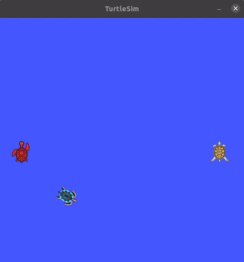

# Turtle Pong

This repository hosts the source code for the ROS `turtle_pong` package, which implements the Pong arcade video game for the Robot Operating System (ROS 1 Noetic) using turtlesim.



To learn how the package was created, please read the [documentation](https://fjp.at/ros/turtle-pong).

## Usage

To use the `turtle_pong` package, clone this repository into the `src` folder of your catkin workspace:

```console
fjp@ubuntu:/home/fjp/catkin_ws/src$ git clone https://github.com/fjp/ros-turtle-pong.git
```

Then build the workspace with `catking-tools` or `catkin_make` and source the new package:

```console
# catkin-tools:
fjp@ubuntu:/home/fjp/catkin_ws$ catkin build
# or use
fjp@ubuntu:/home/fjp/catkin_ws$ catkin_make
# source your workspace using the setup.bash or setup.zsh depending on your shell
fjp@ubuntu:/home/fjp/catkin_ws$ source devel/setup.bash
fjp@ubuntu:/home/fjp/catkin_ws$ source devel/setup.zsh
```

Finally, start `roscore`, run `turtlesim` and `pong.launch`:

```console
roscore
rosrun turtlesim turtlesim_node
roslaunch turtle_pong pong.launch
```

Note that each of the three commands above should be executed from another terminal so that it will run in its own process.

The game can be played with the w/s keys and the up/down arrow keys to control the left and right player (turtle), respectively.

## ROS Node Graph


## Current Version and Missing Features

This is the first release (version 0.0.0). The following features are planned, and contributions to them or new features and code improvements are welcome.

- Handle missed ball cases (left and right)
- Add scoreboard logic (for example, using a new turtle to draw player scores)
- Fix bounce angle logic when the ball hits a paddle.
- Add AI Player
- Improve keyboard input
- Fix the order of node launches
- ...

The short video below gives more insights into what is currently implemented:

[](https://youtu.be/i83dNyfm_QE)
